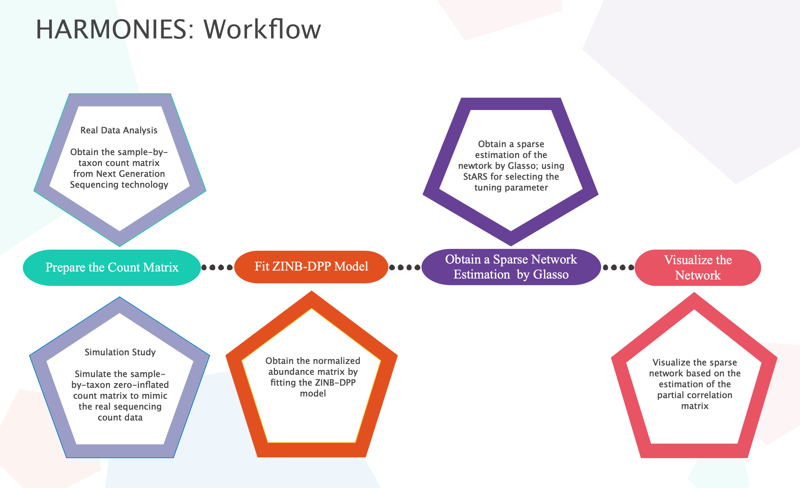
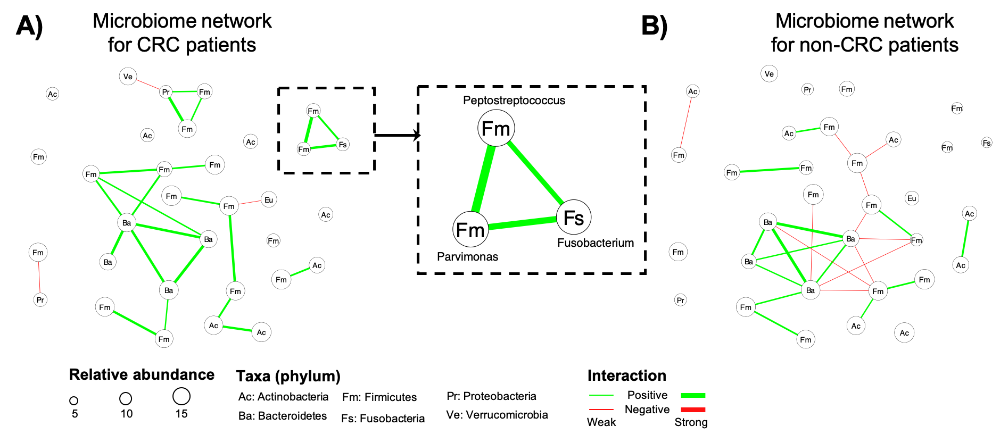

```{r setup, include=FALSE}
knitr::opts_chunk$set(echo = TRUE)
```

```{r load_main_function, message=FALSE,cache = FALSE,include=FALSE }
source("../simu.data.R")
source("../main.R")
source("../utility.R")
library(networkD3)
library(igraph)
```


# HARMONIES 
A Hybrid Approach for Microbiome Networks Inference via Exploiting Sparsity.
```{r, workflow, out.width="70%", include=TRUE, fig.align="center", fig.cap=c(" "), echo=FALSE}
library(knitr)

```


## Introduction
HARMONIES is a Bayesian frequentist hybrid method that infers the network based on microbiome count data. HARMONIES consists of three major steps:

 1. Normalizing the microbiome count data by fitting a zero-inflated negative binomial(ZINB) model with Dirichlet process prior (DPP)
 2. Estimating the sparse precision matrix by applying graphical lasso to the normalized abudance 
 3. Selecting the tuning parameter in graphical lasso by a stability-based approach (StARS)

Please refer to our paper for more details of HARMONIES: ["HARMONIES: A Hybrid Approach for Microbiome Networks Inference via Exploiting Sparsity"](https://github.com/shuangj00/HARMONIES), Jiang S, et al., 2019


## Contents
* [Installation](#installation)
* [Dependency](#dependency)
* [Simulated data: A Toy Example](#examples)
  * [Simulate Example Data](#simulation)
  * [Infer the sparse network](#fit-zinbdpp)
* [Real data: A Case Study of Colorectal Cancer]
* [Contact](#contact)


## Installation
The HARMONIES algorithm is implemented in `R` and `Rcpp`. Users who are not famaliar with basic R programming are suggested to use our web server (update soon) to run HARMONIES with a user-friendly GUI.

We need to first load the functions:
```{r, eval=FALSE}
source("/functions/main.R")
source("/functions/simu.data.R")
```

## Dependency
R (version 3.5.0 or later)

**R Packages**

- Rcpp (version 1.0.2 or later)
- pulsar (version 0.3.5 or later)
- huge (version 1.3.2 or later)
- qgraph (version 1.6.3 or later)
- igraph (version 1.2.4.1 or later)
- networkD3 (version 0.4 or later)
- plyr (version 1.8.4 or later)


## Simulated data: A Toy Example

This section provides a quick tutorial of implementing HARMONIES on a simulated dataset. The package `HARMONIES` includes functions to generate zero-inflated count matrix and to visualize the underlying network structure of the simulated data.

### Simulate Example Data
Assume we have $p = 30$ taxa. First we get an adjcant matrix and the true underlying partial correlation matrix.

```{r simulate_network, message = FALSE}
graph.info = get.adjmatrix(p = 30, edge.prob = 0.1)
network.information = simu.network(adj.matrix = graph.info$adj.matrix)
```

Next we visualize the network structure
```{r viz_network, message = FALSE, fig.align='center', fig.height=4, fig.width=4}
partical.correlation = network.information$Pcorr
colnames(partical.correlation) = NULL
rownames(partical.correlation) = NULL
visualize.networkD3(pcor.mat = partical.correlation)
```
Notice that a <span style="color:green">green</span> edge represents a positive partial correlation while a <span style="color:red">red</span> edge represents a negative partial correlation.


Given this underlying network structure (the partial correlation and the corresponding variance-covariance matrices), we simulate the overdispersed count data with zero inflation from a Dirichlet Multinomial (DM) model.

```{r generate_count, message = FALSE}
covar.mat = network.information$Sigma
count.info = get.countmat(n = 200, Sigma = covar.mat)
count.matrix = count.info$Y
```

Here, `count.info` contains the following information:

 - `Y`: the observed count matrix (with zero-inflation)
 - `Y.full`: the true count matrix (without the added zeros)
 - `Mu.mat`: the underlying multivariate normal data that used as a parameter in the DM data generation
 - `Sigma`: the variance-covariance matrix of the multivariate normal data


### Infer the sparse network
Given the observed count data, the main function `HARMONIES` consists the following steps: 1. Fit the ZINB-DPP model to obtain the normalized abundance. 2. Infer a sparse network using graphical lasso based on the normalized abundance. 3. Select the optimal tuning parameter in grahical lasso by Stability Approach to Regularization
Selection (StARS).

#### Prepare the input data
The input of `HARMONIES` includes the following:

 - `count.matrix` The $n-$by$-p$ (i.e. sample-by-taxon) count matrix
 - `phenotype` A numerical vector indicating the phenotype of the $n$ samples. If only have one sample group, use a vector of zeros. If have two sample groups, use a vector of zeros and ones. The current method can handle two phenotyeps at most
 - `N.mcmc` Number of MCMC iterations with first half discarded as burn-in. Recommonded value is at leaset $10,000$ (default)
 - `b` Shape hyper parameter of the variance paraemeter in the ZINB-DPP model ($b = 1$ by default)
 - `h ` Scale hyper parameter of the variance paraemeter in the ZINB-DPP model ($h = 10$ by default)
 - `sparsity.cutoff` A threshold between $0-1$. Taxa with proportions of observed zeros larger than the threshold  will be dropped for the network inference ($=0.5$ by default)
 - `beta.stars` The stability parameter used in StARS method ($=0.05$ by default)
 - `n.rep` Number of subsamples used in StARS method ($=20$ by default) 
 - `bayes.fdr` Bayesian false discovery rate controled in the normalization step ($=0.05$ by default; recommended range is $0-0.1$)
 - `seed` Random seed


#### Implementing HARMONIES
In this toy example, we only have one phenotype, and therefore the `phenotype` is a vector of $0$ with length $n=200$. 


```{r run_harmonies, cache = TRUE, warning=FALSE}
inference.results = HARMONIES(count.matrix = count.matrix, 
                              phenotype = rep(0, 200), 
                              N.mcmc = 10000, 
                              beta.stars = 0.05)
```

The output of `HARMONIES` includes

 - `partial.corr`: the estimated partial correlation
 - `edge.estimation`: the edge information of the edge(s) in the resulted network (source, target, the corresponding partial correlation value)
 - `node.estimation` the node information in the resulted network with the following:
   -  the abundance information
   - (optional) if have two phenotypes, the output supplies the additional information of (1) fold change of the abundance between phenotype groups; (2) posterior probability of a taxon to be discriminating between phenotypes

We now visualize the estimated newtork structure
```{r check_result,  warning=FALSE, fig.align='center', fig.height=6, fig.width=6}
visualize.networkD3(pcor.mat = inference.results$partial.corr)

```

By comparing it with the actually one, we can see all the relatively strong signals are successfully captured by HARMONIES.


```{r check_truth, eval=FALSE, include = F, warning=FALSE, fig.align='center', fig.height=4, fig.width=4}
mu.true = count.info$Mu.mat
pcor.true = est.pcor(mu.true,beta.stars = 0.05)
visualize.networkD3(pcor.mat = pcor.true)
```
## Real data: A Case Study of Colorectal Cancer

In the real data studyof colorectal cancer (CRC), we implemented HARMONIES to handle two phenotype groups. 

The real data we study here is published by [@feng2015gut]. The count matrix consists $n = 144$ samples with $p=187$ genus. The $144$ subjects forms two groups, CRC patients ($43$ labeled as $1$) and nonCRC controls ($101$ labeled as $0$). 


HARMONIES achieves a simultaneous modeling of subjects from two groups. This process benenfits our analysis in the following two aspects:

 - Identifying the discriminatory taxa and studying their role in the networks
 - Increasing the sample size in estimating the normalized abundance of those non-discriminatory taxa
 
When having two phenotypes, HARMONIES provides the following addtional information for the nodes in the resulted networks:

  1. Abundances of each taxon in both groups
  2. Posterior probability of a taxon to be discriminatory between two groups
  3. Fold change of a taxon's abundance of group 1 over group 0

One can use these additional information as input for other visualization tools, such as Cytoscape, for further visualization and analysis. For example, the following figures are generated by Cytoscape, where the node size is determined by the abundance information, and the nodes (taxa) are named by their taxonomic ranks.

```{r, crc_example, out.width="70%", include=TRUE, fig.align="center", fig.cap=c("Using Cytoscape to Make Network Plot"), echo=FALSE}
library(knitr)

```


## Contact

Shuang Jiang <shuangj@smu.edu>, Department of Statistical Science, Southern Methodist University, Dallas, TX 75275


`r if (knitr::is_html_output()) '## References {-}'`

